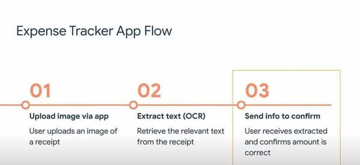
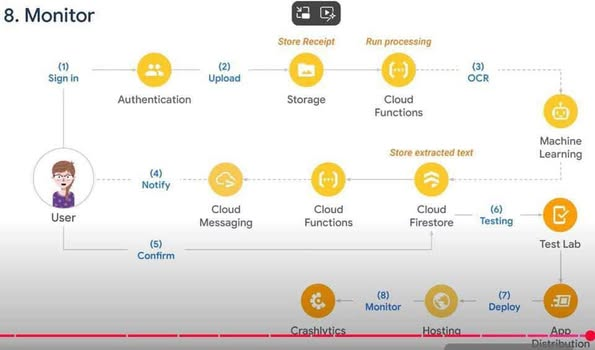

# Software-Quality-Assurance

Flutter - CI/CD - automation testing - android - web

# PART I: Software quality Assurance

### Chương 1: The software quality challenge

- Software errors, faults and failures Classification of the causes of software errors
- Software quality assurance - definition and objectives
- Software quality assurance in software engineering

### Chương 2: Software quality factors  

- The need for comprehensive software quality requirements
- Classifications of software requirements into software quality factors
- Product operation software quality factors
- Alternative models of software quality factors
- Software compliance with quality factors

### Chương 3: The components of the software quality assurance system

- The SQA system – an SQA architecture
- Software project life cycle components
- Infrastructure components for error prevention and improvement
- Management SQA components, SQA standards, system certification, and assessment components

### Chương 3: The components of the software quality assurance system (cont)

- Software Activities and Process of Quality engineering
- Quality planning
- Quality assessment and improvement QA & QC and SQA activities in software process
- Organizing for SQA – the human components
- Considerations guiding construction of an organization’s SQA system

### Chương 4: Sofware quality assurance in Software Engineering

- Contract review
- Requirement review
- SQA in Software project managements
- SQA in software developent  processes model
- Static testing and dynamic testing in SQA  

### Chương 4: Sofware quality assurance in Software Engineering (cont)

- SQA in Analysis, design and coding phases

### Chương 4: Sofware quality assurance in Software Engineering (cont) SQA in software testing phases and maitenance components

# PART II:  Automatic Testing

### Chương 5: Automatic Testing  

- What is Automation Testing?
- Why Automated Testing?
- Which Test Cases to Automate?
- Automated Testing Process
- Test tool selection
- How to Choose an Automation Tool?

### Chương 5: Exectue automatic testing (tt)

- The Test Team
- Test Automation Plan
- Planning the Test Cycle
- Test Suite Design
- Test Cycle Design
- Test execute
- Test metrics
- Management reporting

### Chương 6:  Fundamental of Test automation

- Requirements for automated software testing
- Selection tools
- Testing types and tools

### Chương 7: Automatic unit testing

### Chương 8: Automatic Test in integration and system test  

- Winform testing
- Web application testing
- Mobile testing

### Flow

## Resource

[fireship](https://fireship.io/snippets/setup-nestjs-on-cloud-functions/)

### Keyword

