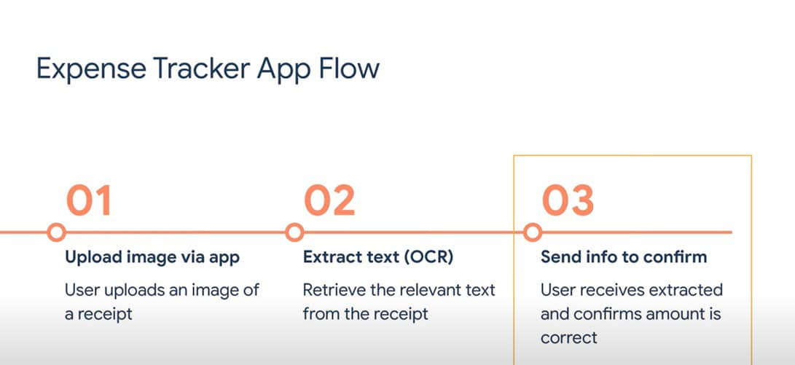
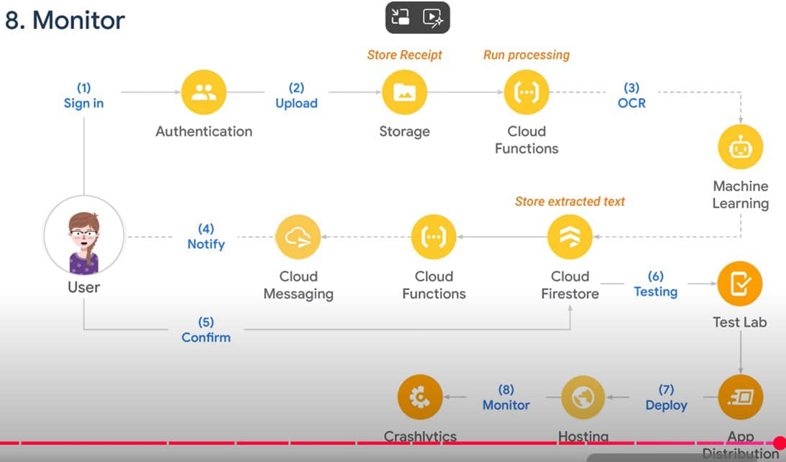

# monitor_tracking

A new Flutter project.

## Getting Started

This project is a starting point for a Flutter application.

A few resources to get you started if this is your first Flutter project:

- [Lab: Write your first Flutter app](https://docs.flutter.dev/get-started/codelab)
- [Cookbook: Useful Flutter samples](https://docs.flutter.dev/cookbook)

For help getting started with Flutter development, view the
[online documentation](https://docs.flutter.dev/), which offers tutorials,
samples, guidance on mobile development, and a full API reference.

## Installation

If you're new to Flutter the first thing you'll need is to follow the [setup instructions](https://flutter.dev/docs/get-started/install).

Once Flutter is setup, you can use the latest `stable` channel:

- `flutter channel stable`
- `flutter upgrade`

Using `config` to enable run platforms:

- `flutter config --enable-web`
- `flutter config --enable-windows-desktop`
- `flutter config --enable-macos-desktop`
- `flutter config --enable-linux-desktop`

Tracking devices:

- `flutter devices`

Once on `stable` you're ready to run the app on your local device or simulator:

- `flutter run -d ios`
- `flutter run -d android`
- `flutter run -d web`
- `flutter run -d macos`

Running on specifies device:

- `flutter run -d <device-id>`

Run default:

- `flutter run`

Running on mode products: "Increasing performance. Don't debug":

- `flutter run --release`

Running on mode dev: "Minimizable performance. With debug":

- `flutter run --release`

## Content

